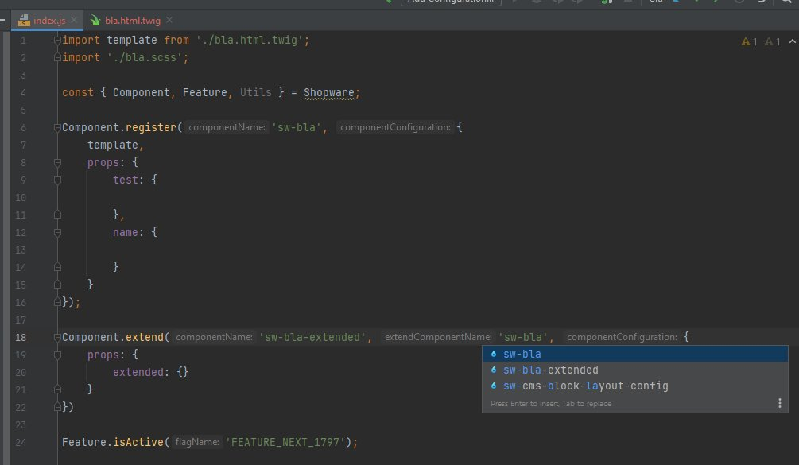
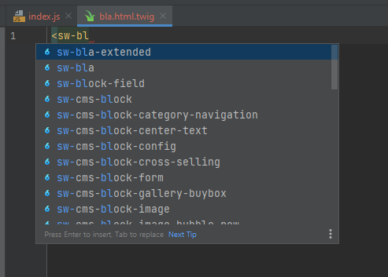
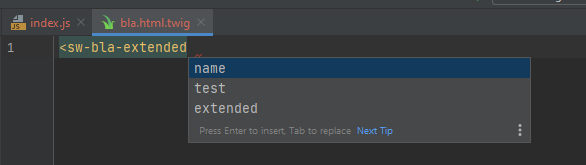
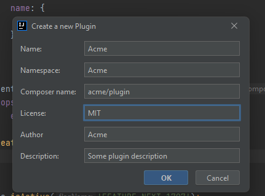
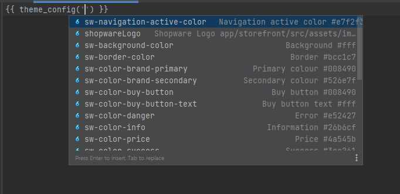
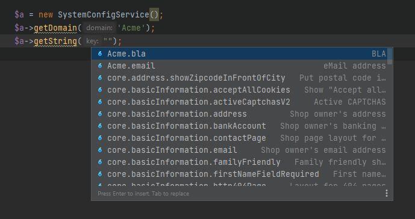
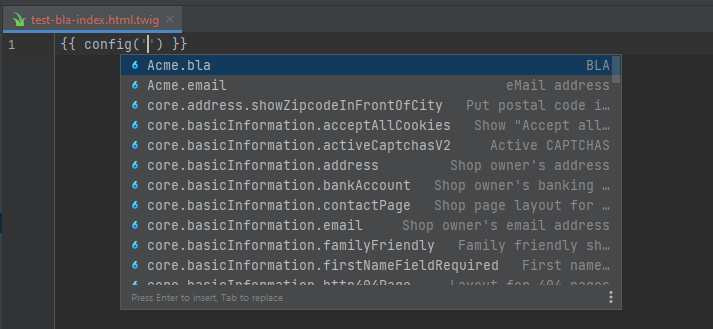
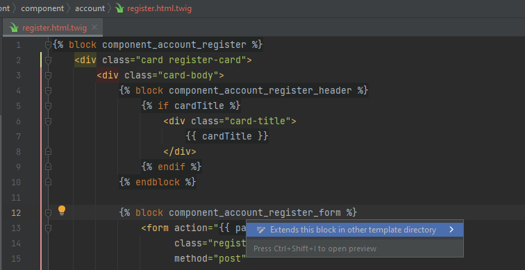
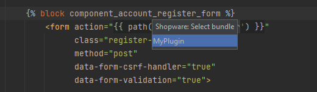
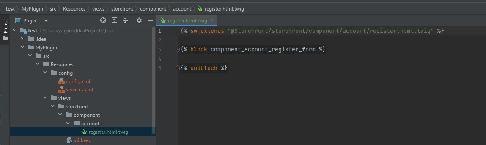

# Shopware 6 Toolbox


[](https://plugins.jetbrains.com/plugin/17632)
[](https://plugins.jetbrains.com/plugin/17632)

<!-- Plugin description -->
Shopware 6 Toolbox is a helper plugin for Shopware 6 development. It adds some live templates and scaffolding of common Shopware files.

Current features:

- Lot of live templates for developing. Use STRG + J to see all live templates of current scope
- Generators:
  - Vue.js Admin component
  - config.xml
  - `Extend this block` in Storefront with auto file creation
  - Vue module
  - Scheduled task
  - Changelog
- Inspection to show an error when abstract class is used incorrectly in the constructor
- Autocompletion for:
  - Admin component
  - Snippets in Administration and Storefront 
  - Storefront functions theme_config, config, seoUrl, sw_include and sw_extends
  - Repositories at `this.repositoryFactory.create`
  - `Module.register` labels
  - Show only admin component autocompletion when the twig file is next to an index.js
  - Feature flag
- [Twig Block Versioning](https://www.shopware.com/en/news/twig-block-versioning-in-shopware-phpstorm-plugin/) — [how it works](https://github.com/shopware/shopware6-phpstorm-plugin/blob/main/doc/twig-versioning.md)  
<!-- Plugin description end -->

## Installation

- Using IDE built-in plugin system (**recommended**):

  <kbd>Settings/Preferences</kbd> > <kbd>Plugins</kbd> > <kbd>Marketplace</kbd> > <kbd>Search for "Shopware 6 Toolbox"</kbd> >
  <kbd>Install Plugin</kbd>
  
- Manually:

  Download the [latest release](https://github.com/shyim/shopware6-phpstorm-plugin/releases/latest) and install it manually using
  <kbd>Settings/Preferences</kbd> > <kbd>Plugins</kbd> > <kbd>⚙️</kbd> > <kbd>Install plugin from disk...</kbd>

### Pre-release updates

To receive pre-release builds, open <kbd>Settings/Preferences</kbd> > <kbd>Plugins</kbd> > <kbd>⚙️</kbd> >
<kbd>Manage Plugin Repositories...</kbd> and add:

```text
https://plugins.jetbrains.com/plugins/eap/17632
```

The EAP channel includes pre-releases and stable releases. Remove this repository to return to stable updates;
if you want to downgrade immediately, reinstall the plugin from the Marketplace.

## Publishing releases

- Set `pluginVersion` in `gradle.properties` to the next version, such as `0.1.2-eap.1` for a pre-release or `0.1.2` for a stable release.
- After a successful build on `main`, the workflow creates a draft release. Versions with a pre-release suffix are automatically marked as pre-releases.
- Review and publish the draft. GitHub releases marked **Set as a pre-release** publish only to `eap`; stable releases publish to both `default` and `eap`.

The release tag supplies the built plugin version (an optional leading `v` is removed). Use a unique pre-release version
for each build, then publish a separate stable release with a stable version. Changing an existing release's pre-release
checkbox does not publish another build. Only stable releases create a changelog update pull request.

For local publishing, `./gradlew publishPlugin` infers the same channels from `pluginVersion`.
Override them with `-PpluginChannels=eap` or `-PpluginChannels=default,eap` if needed.
See [JetBrains' custom release channel documentation](https://plugins.jetbrains.com/docs/marketplace/custom-release-channels.html).

## Plugin contract verification

`./gradlew verifyPluginContract` runs the full contract chain in one entry point:

1. `verifyIndexContractManifest` — static check that every `fileBasedIndex` registered in `plugin.xml`
   and every index class in `src/main/kotlin/de/shyim/shopware6/index` is listed in
   `src/test/resources/index-contract/manifest.txt` (differences in either direction fail the build),
   that each manifest entry has a non-empty fixture directory under `src/test/testData/contract/`, and
   that every `getTestDataPath()` referenced from the test sources exists. Missing testData is never
   skipped silently.
2. `test` — unit tests, including the index contract test (fixture collection, externalizer
   serialization round-trip, version/byte snapshots; see [doc/index-versioning.md](doc/index-versioning.md))
   and the order isolation test (same-named Twig block, admin component and snippet loaded into two
   fixture projects in opposite order; scoped queries must only see their own project).
3. `indexTestsRandomized` — a second pass over all index tests with shuffled class and method order
   to surface order-dependent pollution of project-level index caches. The used seed is printed to the
   test output; reproduce a specific order with `./gradlew indexTestsRandomized -PindexTestSeed=<seed>`.
4. `buildPlugin` + `verifyPluginZipContract` — checks the distribution ZIP for `plugin.xml` with the
   declared plugin id and version, the plugin icon, file and live templates, and the absence of caches,
   sandbox state, logs or test data. A stable, entry-sorted SHA-256 manifest of the archive content is
   written to `build/reports/pluginContract/plugin-zip-manifest.sha256`.

The entry point works offline once dependencies are resolved (`./gradlew verifyPluginContract --offline`
after a first online run). Cleanup is confined to the `build/` directory; test fixtures under
`src/test/testData` and user directories are never touched. When an index version or its serialized
form changes intentionally, regenerate the snapshots with
`./gradlew test -Pindex.contract.updateSnapshots=true` and document the change in
[doc/index-versioning.md](doc/index-versioning.md).

On CI the same entry point runs in the `test` job of `.github/workflows/build.yml`:

```yaml
- name: Verify plugin contract
  run: ./gradlew verifyPluginContract
```

## Showcase

### Components

<blockquote class="twitter-tweet"><p lang="en" dir="ltr">Adding admin component completion to <a href="https://twitter.com/hashtag/Shopware?src=hash&amp;ref_src=twsrc%5Etfw">#Shopware</a> 6 Toolbox plugin. Autocomplete for component + props working. Jumping to the component works also using STRG + CLICK. Also added feature flag autocompletion + a quick plugin generator <a href="https://t.co/7KmlAyG5UD">pic.twitter.com/7KmlAyG5UD</a></p>&mdash; Shyim (@Shyim97) <a href="https://twitter.com/Shyim97/status/1441763329115103232?ref_src=twsrc%5Etfw">September 25, 2021</a></blockquote>

#### Component Extent Autocomplete



#### Lookup in Twig



#### Properties



### Create Plugin



### Config Autocomplete

<blockquote class="twitter-tweet"><p lang="en" dir="ltr">New day new <a href="https://twitter.com/hashtag/Shopware?src=hash&amp;ref_src=twsrc%5Etfw">#Shopware</a> plugin update prepared. This time theme_config and config autocomplete. Have a wish for the next feature? Create an issue with your idea :)<a href="https://t.co/Tmd66aVA5p">https://t.co/Tmd66aVA5p</a> <a href="https://t.co/bqM8jtylyt">pic.twitter.com/bqM8jtylyt</a></p>&mdash; Shyim (@Shyim97) <a href="https://twitter.com/Shyim97/status/1442952362792943617?ref_src=twsrc%5Etfw">September 28, 2021</a></blockquote>

#### Theme Config



#### System Config



#### Config in Twig



#### Strings 


### Blocks

<blockquote class="twitter-tweet"><p lang="en" dir="ltr">How to be lazier while creating <a href="https://twitter.com/hashtag/Shopware?src=hash&amp;ref_src=twsrc%5Etfw">#Shopware</a> 6 extensions. Alt+Enter on any Storefront twig block =&gt; Extend block. 😂. <a href="https://t.co/uf9hhi9Ugr">pic.twitter.com/uf9hhi9Ugr</a></p>&mdash; Shyim (@Shyim97) <a href="https://twitter.com/Shyim97/status/1443320004225687565?ref_src=twsrc%5Etfw">September 29, 2021</a></blockquote>

#### Step 1



#### Step 2



#### Step 3


